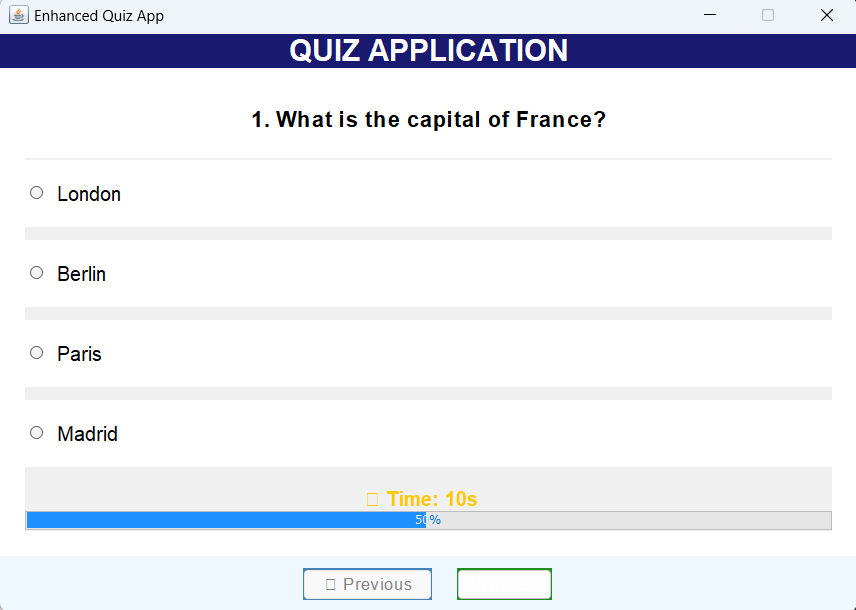
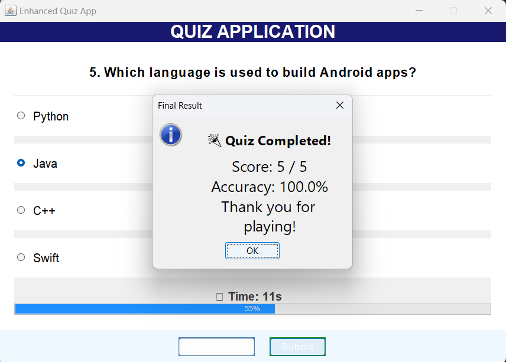

# 🎯 Quiz Application

A desktop quiz application built with **Java Swing**, featuring a timer, multiple-choice questions, and a clean user interface.

## 🖼️ Screenshot



## ✅ Features
- Modern UI with colors and fonts
- 20-second countdown timer with progress bar
- Score tracking and final result summary
- Navigation: Previous / Next / Submit
- Auto-submit when time runs out

## 🚀 How to Run
```bash
javac src/EnhancedQuizApp.java
java EnhancedQuizApp
